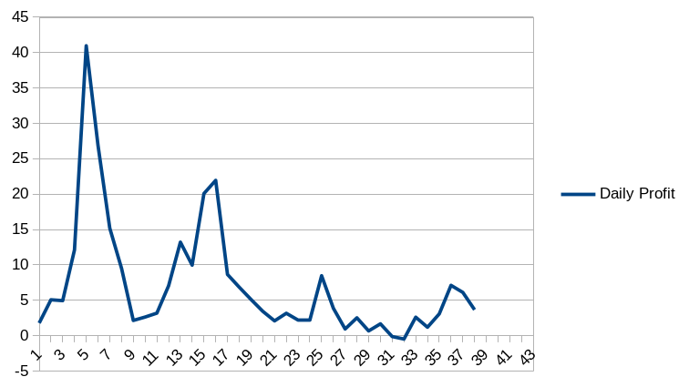

# yakFarmer
A reinvesting bot designed to make profit in the yield yak aggregator. 

Built together with [ignatyus](https://github.com/ignatyus).

## YieldYak

YieldYak is an auto-compounding platform that uses yield farming rewards to optimize users' return on liquidity mining programs. One of the main aspects that differentiates YieldYak from its competitors is the way it handles "auto-compounding". 

Instead of certain privilaged users triggering and getting a certain cut from the rewards acummulated, everyone who triggers the reinvesting function gets a small ratio of the total rewards on the yieldyak farm. This creates an open ecosystem anyone who contributes makes the system function also gets rewarded.  

## The Bot

This bot basically provides a basic interface for automating the task of reinvesting the reward tokens in the yieldyak farms. User can set the profit limit (in terms of AVAX), set the max_limit of reward tokens to determine when to swap them into AVAX, can see the last account who triggered the reinvest function for a specific farm etc.

## Revenue

The bot started to run around 19 April 2021 and has been kept running until 1 June 2021, which almost raised 280 AVAX. 
Here is a graph of the daily performance of the bot in terms of AVAX :

## Current Status

The profit of the bot was also directly related to other people who are reinvesting. As the time passed, more people realized the almost riskless profitability here and this raised a race condition as only the first people who trigger the reinvest function (on the blockchain) got rewarded.  After almost 1 and a half month, the bot become non-profitable. 
